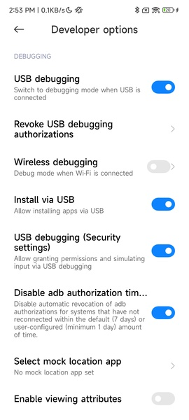

# Table of Contents

* [Logcat Entry Configuration](#logcat-entry-configuration)

* [Logcat Activity Orientation Configuration](#logcat-activity-orientation-configuration)

* [Set Logcat Log Display Colors](#set-logcat-log-display-colors)

* [Set Logcat Default Filter Conditions](#set-logcat-default-filter-conditions)

* [Set Logcat Log Filter Rules](#set-logcat-log-filter-rules)

* [Show All Application Printed Logs](#show-all-application-printed-logs)

* [How to Use This Library in Production](#how-to-use-this-library-in-production)

* [What to Do If the Entry Cannot Be Displayed in Multi-Process Situations](#what-to-do-if-the-entry-cannot-be-displayed-in-multi-process-situations)

* [How to Disable Automatic Merging of Logs with the Same TAG](#how-to-disable-automatic-merging-of-logs-with-the-same-tag)

#### Logcat Entry Configuration

* The framework provides two default entry points:

    * Notification bar entry

    * Floating window entry

* The default rule for the entry: If the notification bar permission is granted, the notification bar entry will be used first; otherwise, the floating window entry will be displayed.

* How to modify the default rule? You can add the following configuration in the manifest file:

```xml
<manifest>
    <application>
        <!-- Floating window entry -->
        <meta-data
            android:name="LogcatWindowEntrance"
            android:value="false" />
        <!-- Notification bar entry -->
        <meta-data
            android:name="LogcatNotifyEntrance"
            android:value="true" />
    </application>
</manifest>
```

#### Logcat Activity Orientation Configuration

* `LogcatActivity` follows the device screen orientation by default. If you need to fix it to portrait orientation, add the following configuration in your manifest file:

```xml
<activity
    android:name="com.hjq.logcat.LogcatActivity"
    android:configChanges="orientation|screenSize|keyboardHidden"
    android:launchMode="singleInstance"
    android:screenOrientation="portrait"
    android:theme="@style/Theme.AppCompat.Light.NoActionBar"
    tools:node="replace" />
```

#### Set Logcat Log Display Colors

* Add your preferred color configuration in the project's `values/color.xml`, for example:

```xml
<color name="logcat_level_verbose_color">#FFBBBBBB</color>
<color name="logcat_level_debug_color">#FF33B5E5</color>
<color name="logcat_level_info_color">#FF99CC00</color>
<color name="logcat_level_warn_color">#FFFFBB33</color>
<color name="logcat_level_error_color">#FFFF4444</color>
<color name="logcat_level_other_color">#FFFFFFFF</color>
```

#### Set Logcat Default Filter Conditions

* To modify the framework's default filter conditions, just add the following configuration in the manifest file:

```xml
<manifest>
    <application>
        <!-- Default search keyword -->
        <meta-data
            android:name="LogcatDefaultSearchKey"
            android:value="MainActivity" />
        <!-- Default log level -->
        <meta-data
            android:name="LogcatDefaultLogLevel"
            android:value="E" />
    </application>
</manifest>
```

#### Set Logcat Log Filter Rules

* Add the log TAGs you want to filter in the project's `values/string.xml`, for example:

```xml
<string-array name="logcat_filter_list" tools:ignore="ExtraTranslation">
    <item>ActivityThread</item>
    <item>InputMethodManager</item>
    <item>OpenGLRenderer</item>
    <item>VideoCapabilities</item>
    <item>ViewRootImpl</item>
    <item>Settings</item>
    <item>Looper</item>
    <item>TextView</item>
    <item>TypefaceUtils</item>
    <item>MultiDex</item>
    <item>AudioManager</item>
    <item>ConnectivityManager</item>
    <item>NetworkSecurityConfig</item>
    <item>HwPolicyFactory:</item>
    <item>HwWidgetFactory:</item>
    <item>HwApiCacheMangerEx</item>
    <item>HwWechatOptimizeImpl</item>
    <item>HwSplineOverScrollerExImpl</item>
    <item>HwAppInnerBoostImpl</item>
    <item>HwCustConnectivityManagerImpl</item>
    <item>HwApsImpl</item>
    <item>HwPhoneWindow</item>
    <item>HwAutofillHelper</item>
    <item>hwbr_engine_mainprocess</item>
    <item>hwbr_engine_hwbr_event</item>
    <item>hwbr_engine_PathUtils</item>
    <item>hwbr_engine_AwContents</item>
    <item>hwbr_engine_cr_IMM</item>
    <item>hwbr_engine_LibraryLoader</item>
    <item>hwbr_engine_BrowserStartup</item>
    <item>hwbr_engine_cr_WebContentsImpl</item>
    <item>CrashReport</item>
    <item>CrashReportInfo</item>
    <item>CrashReport-Native</item>
    <item>LeakCanary</item>
    <item>Timeline</item>
    <item>AssistStructure</item>
    <item>EgretLoader</item>
    <item>OverScrollerOptimization</item>
    <item>HiTouch_PressGestureDetector</item>
    <item>HiTouch_HiTouchSensor</item>
    <item>FLTAG_SFM</item>
    <item>FLTAG_FM</item>
    <item>libEGL</item>
    <item>AwareLog</item>
    <item>AwareBitmapCacher</item>
    <item>AwareAppScheduleManager</item>
    <item>FeatureFactory</item>
    <item>WebViewFactory</item>
    <item>ConfigStore</item>
    <item>mali_winsys</item>
    <item>ZrHung.AppEyeUiProbe</item>
    <item>chatty</item>
    <item>stylus</item>
    <item>libc</item>
    <item>chromium</item>
    <item>Perf</item>
    <item>FeatureParser</item>
    <item>Binder:intercep</item>
    <item>cr_LibraryLoader</item>
    <item>cr_BrowserStartup</item>
    <item>DecorView</item>
    <item>DecorView[]</item>
    <item>ForceDarkHelper</item>
    <item>skia</item>
    <item>AdrenoGLES-0</item>
    <item>ViewContentFactory</item>
    <item>MiuiFrameworkFactory</item>
    <item>MIUIInput</item>
    <item>cr_media</item>
    <item>cr_CachingUmaRecorder</item>
    <item>TetheringManager</item>
    <item>MiuiFreeDragHelper</item>
    <item>MiuiFreeDragImpl</item>
    <item>ContentProviderMonitor</item>
    <item>ContentCatcher</item>
    <item>ApplicationLoaders</item>
    <item>RenderInspector</item>
</string-array>
```

#### Show All Application Printed Logs

* First, note that an app itself cannot obtain logs from other apps.

* If you need this, it can be achieved by entering the following adb command on your computer:

```text
// Grant the specified app permission to read logs. Replace com.hjq.logcat.demo with your package name.
adb shell pm grant com.hjq.logcat.demo android.permission.READ_LOGS
```

* Restart the app for it to take effect (some phones may automatically kill the process). Once authorized, the permission will remain unless the app is uninstalled.

* If the above command fails and you see the following message:

```text
Exception occurred while executing 'grant':
java.lang.SecurityException: grantRuntimePermission: 
    Neither user 2000 nor current process has android.permission.GRANT_RUNTIME_PERMISSIONS.
```

* Then you need to enable the `USB debugging (Security settings)` option in Developer Options.



* If you still get the same message after enabling, try the following:

    * Wait 5 minutes
    
    * Replug your phone

    * Check if `USB Installation` is enabled

    * Re-enable `USB Debugging (Security)`

    * Restart the cmd terminal

    * Restart your phone and try again

    * Try another phone

* The author recommends not enabling this feature unless necessary, as it will increase the amount and complexity of logs displayed by Logcat, making searching more difficult.

#### How to Use This Library in Production

* It is highly discouraged to use this library in production, as it is designed for debugging purposes. The author cannot guarantee its behavior in production. However, if you must do so, follow these steps:

* Step 1: Change the dependency from `debugImplementation` to `implementation`:

```groovy
dependencies {
    debugImplementation 'com.github.getActivity:Logcat:x.x'
}
```

```groovy
dependencies {
    implementation 'com.github.getActivity:Logcat:x.x'
}
```

* Step 2: Hide the Logcat entry points:

```xml
<manifest>
    <application>
        <!-- Floating window entry -->
        <meta-data
            android:name="LogcatWindowEntrance"
            android:value="false" />
        <!-- Notification bar entry -->
        <meta-data
            android:name="LogcatNotifyEntrance"
            android:value="false" />
    </application>
</manifest>
```

* Step 3: Manually launch Logcat at the appropriate time:

```java
try {
    Class<?> clazz = Class.forName("com.hjq.logcat.LogcatActivity");
    startActivity(new Intent(this, clazz));
} catch (ClassNotFoundException e) {
    e.printStackTrace();
}
```

#### What to Do If the Entry Cannot Be Displayed in Multi-Process Situations

* This issue has been raised before [Logcat/issues/35](https://github.com/getActivity/Logcat/issues/35), but after verification, it cannot be fixed. This is because when a subprocess is started, the Application object is created again and the onCreate method is called again. However, the ContentProvider component is different and will not be created again, which causes a problem. The Logcat framework relies on ContentProvider as the initialization entry, but it will not be created again in the subprocess, nor will it be called. This is a fundamental limitation.

* However, there is a workaround: you can manually initialize the Logcat framework as follows:

* Step 1: Remove the Logcat framework initialization entry from the manifest file:

```xml
<?xml version="1.0" encoding="utf-8"?>
<manifest xmlns:android="http://schemas.android.com/apk/res/android"
    xmlns:tools="http://schemas.android.com/tools"
    package="com.xxx.xxx">
    <application>
        <provider
            android:name="com.hjq.logcat.LogcatProvider"
            tools:node="remove" />
    </application>
</manifest>
```

* Step 2: Manually initialize the Logcat framework in Application.onCreate:

```java
public final class XxxApplication extends Application {
   @Override
   public void onCreate() {
      super.onCreate();
       try {
           Class<?> logcatProviderClass = Class.forName("com.hjq.logcat.LogcatProvider");
           Object logcatProvider = logcatProviderClass.newInstance();
           Method attachInfoMethod = logcatProviderClass.getMethod("attachInfo", Context.class, ProviderInfo.class);
           attachInfoMethod.setAccessible(true);
           attachInfoMethod.invoke(logcatProvider, this, null);
       } catch (Exception e) {
           e.printStackTrace();
       }
   }
}
```

#### How to Disable Automatic Merging of Logs with the Same TAG

* When two or more logs with the same TAG are found, and no new TAG logs are inserted in between, the framework will automatically merge them for better display. If you do not need this feature, add the following configuration in the manifest file:

```xml
<manifest>
    <application>
        <!-- Log merging (enabled by default) -->
        <meta-data
            android:name="LogcatAutoMergePrint"
            android:value="false" />
    </application>
</manifest>
```