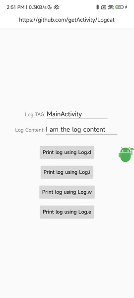

# [中文文档](README.md)

# Log Viewing Framework


* Project address: [Github](https://github.com/getActivity/Logcat)

* [Click here to download demo apk directly](https://github.com/getActivity/Logcat/releases/download/12.3/Logcat.apk)

  


#### Integration Steps

* If your project's Gradle configuration is `7.0 or below`, add the following to your `build.gradle` file:

```groovy
allprojects {
    repositories {
        // JitPack remote repository: https://jitpack.io
        maven { url 'https://jitpack.io' }
    }
}
```

* If your Gradle configuration is `7.0 or above`, add the following to your `settings.gradle` file:

```groovy
dependencyResolutionManagement {
    repositories {
        // JitPack remote repository: https://jitpack.io
        maven { url 'https://jitpack.io' }
    }
}
```

* After configuring the remote repository, add the remote dependency in the `build.gradle` file under the app module:

```groovy
android {
    // Supports JDK 1.8 and above
    compileOptions {
        targetCompatibility JavaVersion.VERSION_1_8
        sourceCompatibility JavaVersion.VERSION_1_8
    }
}

dependencies {
    // Log debugging framework: https://github.com/getActivity/Logcat
    debugImplementation 'com.github.getActivity:Logcat:12.3'
}
```

#### AndroidX Compatibility

* If your project is based on the **AndroidX** library, please add the following configuration to your project's `gradle.properties` file. If already added, you can ignore this step:

```text
# Use AndroidX
android.useAndroidX = true
# Migrate third-party libraries to AndroidX
android.enableJetifier = true
```

* If your project is based on the **Support** library, you do not need to add this configuration.

#### compileSdk Version Requirement

* If your project's `compileSdkVersion` is less than 34, please upgrade it to 34 first:

```groovy
android {
    compileSdkVersion 34
}
```

* If your project's `compileSdkVersion` is greater than or equal to 34, no modification is needed.

#### Compilation Error Handling

* If you encounter the following compilation error after referencing the framework dependency:

```text
AAPT: error: unexpected element <property> found in <manifest><application><service>.
```

* This indicates that your `Gradle` and `Android Gradle Plugin` versions are too low. Please upgrade `Gradle` to `gradle-7.4-all` or above, and upgrade `Android Gradle Plugin` to `7.1.0` or above.

#### Usage

* No need to call any methods, just run the app and grant the floating window permission.

* It works directly in debug mode. In release mode, the library will not be included in the official package, so you can rest assured.

## [For detailed usage of the framework, please click here](HelpDoc-en.md)

#### Framework Highlights

* Only integration is required, no need to call any methods

* Long press on logs to copy or share

* Supports saving logs locally

* Long logs can be collapsed or expanded by clicking

* Log search results support text highlighting

* Supports filtering logs by specified TAG

* Multiple logs with the same TAG are automatically merged and displayed

* Integrated only in Debug, no manual initialization required

#### Other Open Source Projects by the Author

* Android middle office: [AndroidProject](https://github.com/getActivity/AndroidProject)

* Android middle office kt version: [AndroidProject-Kotlin](https://github.com/getActivity/AndroidProject-Kotlin)

* Permissions framework: [XXPermissions](https://github.com/getActivity/XXPermissions)  

* Toast framework: [Toaster](https://github.com/getActivity/Toaster)

* Network framework: [EasyHttp](https://github.com/getActivity/EasyHttp)

* Title bar framework: [TitleBar](https://github.com/getActivity/TitleBar)

* Floating window framework: [EasyWindow](https://github.com/getActivity/EasyWindow)

* Device compatibility framework：[DeviceCompat](https://github.com/getActivity/DeviceCompat)  

* Shape view framework: [ShapeView](https://github.com/getActivity/ShapeView)

* Shape drawable framework: [ShapeDrawable](https://github.com/getActivity/ShapeDrawable)

* Language switching framework: [Multi Languages](https://github.com/getActivity/MultiLanguages)

* Gson parsing fault tolerance: [GsonFactory](https://github.com/getActivity/GsonFactory)

* Nested scrolling layout framework：[NestedScrollLayout](https://github.com/getActivity/NestedScrollLayout)  

* Android version guide: [AndroidVersionAdapter](https://github.com/getActivity/AndroidVersionAdapter)

* Android code standard: [AndroidCodeStandard](https://github.com/getActivity/AndroidCodeStandard)

* Android resource summary：[AndroidIndex](https://github.com/getActivity/AndroidIndex)  

* Android open source leaderboard: [AndroidGithubBoss](https://github.com/getActivity/AndroidGithubBoss)

* Studio boutique plugins: [StudioPlugins](https://github.com/getActivity/StudioPlugins)

* Emoji collection: [EmojiPackage](https://github.com/getActivity/EmojiPackage)

* China provinces json: [ProvinceJson](https://github.com/getActivity/ProvinceJson)

* Markdown documentation：[MarkdownDoc](https://github.com/getActivity/MarkdownDoc)  

## License

```text
Copyright 2020 Huang JinQun

Licensed under the Apache License, Version 2.0 (the "License");
you may not use this file except in compliance with the License.
You may obtain a copy of the License at

   http://www.apache.org/licenses/LICENSE-2.0

Unless required by applicable law or agreed to in writing, software
distributed under the License is distributed on an "AS IS" BASIS,
WITHOUT WARRANTIES OR CONDITIONS OF ANY KIND, either express or implied.
See the License for the specific language governing permissions and
limitations under the License.
```